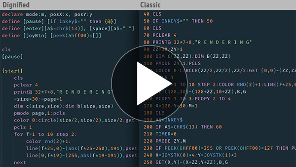

# CoCo Sublime Tools  
**Beta Version**  
For **Sublime Text 3**  
  
**CoCo Sublime Tools** are a set of tools developed for Sublime Text 3 created to improve the experience of working with **CoCo Basic Dignified** and regular **CoCo Basic** programs.  
  
The tools are:  
- A **Build System** for the Dignified and traditional versions of CoCo Basic with conversion, tokenization and execution monitoring capabilities.  
- **Syntax Highlight**s for the Dignified and traditional versions of CoCo Basic.  
- **Theme**s based on Boxy Ocean and Monokai with special scopes for both Basic versions.  
- A **Comment Preference** for the Dignified version.  
  
To install just copy the `CoCo` folder into Sublime `Packages` folder (`~/Library/Application Support/Sublime Text 3/Packages/` on a Mac).  
  
The Dignified Basic version uses a `.bad` extension and the traditional ASCII Basic an `.asc` one.  
  
CoCo Sublime Tools  
:-------------------------:  
[](https://youtu.be/aQfmmiJ9mzo)  
  
## Build System  
  
The Dignified code can be converted, tokenized and run straight from Sublime using **CoCo Basic Dignified**, **XRoar** and **decb** (a tokenizer).  
Traditional CoCo Basic can also be tokenized and run from Sublime.  
  
>When building, the Dignified code (`.bad`) is converted to ASCII (`.asc`) with **CoCo Basic Dignified**, then the ASCII is converted to tokenized Basic (`.bas`) using **decb** and finally the tokenized `.bas` is converted to a `.cas` file to speed load into **XRoar**.  
>If **decb** is not used to tokenize, the `.asc` will be converted to `.cas` for loading into **XRoar** but it will be much slower.  
  
>The build system only works on a Mac for now mostly due to path differences and the way **XRoar** is executed. It can, however, be easily converted to work on Windows and Linux.  
  
>The Build System uses Python 3.8.  
  
  
The build system is composed of the following files:  
```  
CoCo Badig Build.py  
CoCo Badig Build.ini  
CoCo Badig Build.sublime-syntax  
CoCo Basic Dignified.sublime-build  
CoCo Basic Dignified.sublime-syntax  
CoCo Basic Dignified Comments.tmPreferences  
CoCo Basic.sublime-build  
CoCo Basic.sublime-syntax  
cocotocas.py  
decb  
```  
  
Depending on what functionality is required the aforementioned programs need to be installed:  
  
- If coding on the Dignified flavour, a copy of **CoCo Basic Dignified** is needed.  
- **decb** is needed for tokenized output.  
- **cocotocas.py** is needed to convert the `.bas` or `.asc` files into `.cas` for loading into **XRoar**.  
  
The path to these programs () can be set up on the code itself or on `CoCo Badig Build.ini`.  The deafault behaviour of the build system in addition to these can also be setup on ***REM tags*** on the Dignified code. Each setup method have a priority higher than the one before.  
  
### Seting up  
  
**`CoCo Badig Build.ini`**  
  
The only configuration necessary on the `.ini` file are the paths to the support programs being used and any modification to the default behaviour of the build system. All other settings can be left blank.  
  
```ini  
[DEFAULT]  
cocobadig_filepath = [/path_to/cocobadig.py]  
decb_filepath = [/path_to/decb]  
xroar_filepath = [/path_to/xroar.app]  
xrconfig_name = [optional alternative XRoar config file]  
tokenize = [true,false]  
tokenize_stop = [true,false]  
verbose_level = [#]  
```  
  
`cocobadig_filepath = `  
The path to **CoCo Basic Dignified**  
  
`decb_filepath = `  
The path to **decb**  
  
`xroar_filepath = `  
The path to **XRoar**  
  
`xrconfig_name =` Default: none (run **XRoar** with the default machine)  
The config file that will be used instead of the default one on **XRoar**.  
  
`tokenize =` `true` or `false` Default: `true`  
Enable or disable saving a tokenized version of the code.  
  
`tokenize_stop =` `true` or `false` Default: `true`  
If `true` will stop the build on tokenization errors. If `false` will try to continue the build process with the ASCII version of the code (the ASCII version is always saved before tokenization).  
  
`verbose_level =` `#` Default: `3`  
Set the level of feedback given. Will cascade down to the support programs.  
`0` show nothing, `1` errors, `2` errors and warnings, `3` errors, warnings and steps and `4` errors, warnings, steps and details.  
  
***REM tags***  
  
Each support program have its own configurations that can be changed on their installation and `.ini` files. Some of these, however, can be forced using *REM tags* on the Dignified code itself, just add the needed lines anywhere. The *REM tags* will override all other settings including the build variant ones.  
  
```ini  
##BB:export_file=<the_converted_file>  
##BB:export_path=<path_where_to_save_the_converted_file>  
##BB:override_config=<optional alternate config file>  
##BB:convert_only=<true,false>  
##BB:arguments=<coco_basic_dignified_command_line_arguments>  
```  
  
>There is no need to delete a line of REM tag when not using it. They can be toggled off just by changing the `##BB:` prefix (to `## BB:` for instance.)  
  
`##BB:export_file=`  
The name of the converted ASCII file, better with an 8 character name and a `.asc` extension to conform with the standards. The tokenized version will have a `.bas` extension.  
  
`##BB:export_path=`  
The path where the converted code should be saved.  
  
`##BB:override_config=`  
The same as on the `CoCo Badig Build.ini`.  
  
`##BB:convert_only=`  
`true` or `false`. If true will only convert the code otherwise will convert and run.  
  
`##BB:arguments=`  
Pass arguments to **CoCo Basic Dignified**, they are the same as the ones used on the command line and must be separated by commas.  
Arguments can be used here to complement the *REM tags*.  
- Dictate if a tokenized, ASCII or both versions should be saved: `-of <t,a,b>` tells the build system to export a tokenized, an ASCII or both versions respectively.  
  
### Building  
  
The builds are available from the `Tools > Build System` menu and are called:  
  
`CoCo Basic`  
`CoCo Basic Dignified`  
  
The build type can be left on `automatic` when using syntax scopes and the extensions of the Basic flavours, Sublime will choose and use the correct one.  
To run the build just press COMMAND-B on Sublime.  
  
When building the Dignified version, by default, the converted, traditional, code will be saved on the same path as the Dignified with an `.asc` extension. A tokenized version will also be saved with a `.bas` extension. The exported file will then be converted to a `.cas` file, **XRoar** will be opened and run the `.cas`. If no tokenized version was saved, the ASCII `.asc` version will be converted to `.cas` instead but will load much slower.  
Badig Build will try to internally conform the file name to 8 characters.  
  
Each of the builds have some variants that can be chosen by pressing COMMAND-SHIFT-B.  
Once they are chosen they will be used as the default COMMAND-B build until Sublime is closed or another variant is chosen. They are:  
  
- CoCo Basic Dignified:  
`Default`: Will convert, tokenize, run and monitor the Dignified code.  
`Convert only`: Will convert and tokenize (but not run nor monitor) the Dignified code.  
  
- CoCo Basic:  
`Default`: Will only run the traditional Basic code.  
`Tokenize only`: Will only tokenize the traditional Basic code.  
`Tokenize and run`: Will tokenize and run the traditional Basic code.  
  
Arguments passed in `CoCo Badig Build.ini` or on *REM tags* will override the default behaviour of the chosen build variant.  
Every build command will open a new instance of  **XRoar**.  
  
## Syntax Highlight  
  
Two pretty decent syntax highlights, one for the Dignified version and one for the Classic version of CoCo Basic are available.  
  
`CoCo Basic Dignified.sublime-syntax`  
```  
name: CoCo Basic Dignified  
file_extensions: bad  
scope: source.cocobasicdignified  
```  
###  
`CoCo Basic.sublime-syntax`  
```  
name: CoCo Basic  
file_extensions: [bas, asc]  
scope: source.cocobasic  
```  
One of the biggest differences is the Dignified version expects the instructions and variables to be separated by spaces and the Classic accepts them typed together (as per CoCo Basic standards).  
The Classic version also has all the Dignified specifics removed for simplicity but maintains useful ones like the labels highlight on its `REM` lines.  
  
## Themes  
  
`CoCo Monokai.tmTheme`  
A theme based on Monokai.  
  
`CoCo Boxy Ocean.tmTheme`  
A theme based on Boxy Ocean.  
  
They improve the CoCo syntax highlight (traditional and Dignified) with scopes specific for the Dignified code: `define`, `declare`, labels, errors and warnings.  
  
## Comment Preference  
  
`CoCo Basic Dignified Comments.tmPreferences`  
  
Set `##` as the default comment.  
`##` is a Dignified comment that is deleted when the code is converted to the traditional version.  
There is no block comment but all lines selected will be commented.  
  
There is no Classic comment preference as I couldn't find a way to insert the `REM` or `'` AFTER the line number.  
  
  
## Acknowledgments  
  
As always, all of this is offered as is, with no guaranties whatsoever. Use at your own discretion.  
Having said that, enjoy and send feedback.  
Thanks.  
